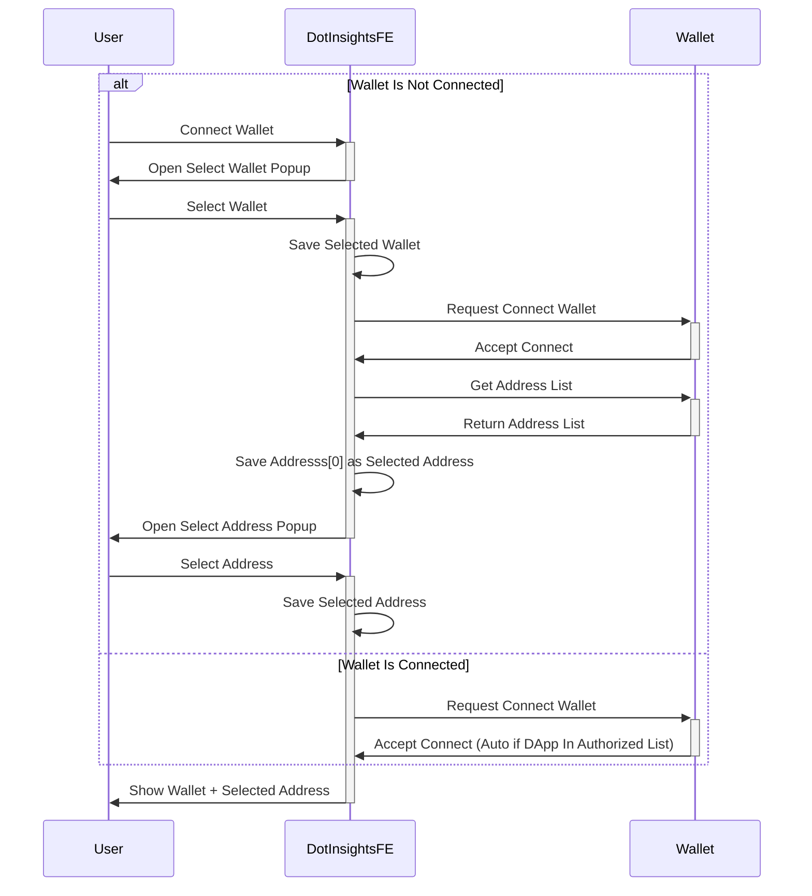
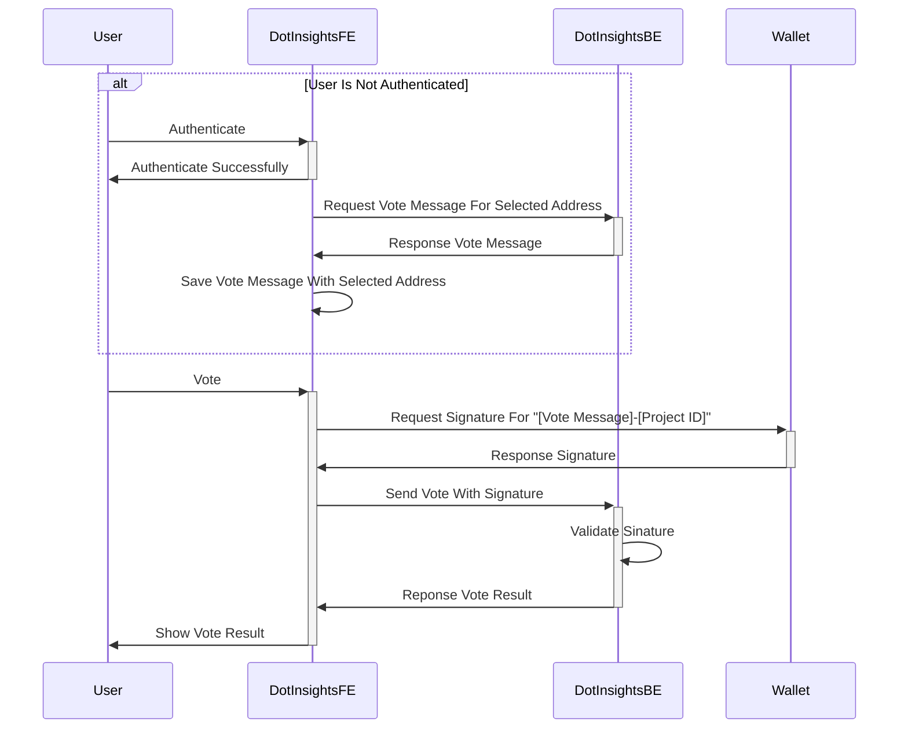
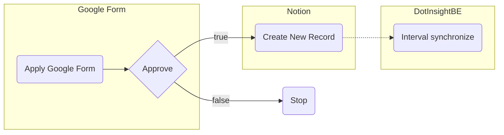

# DotInsights

## Authentication Concept
Here is the main concept of authentication for DotInsights.

## Voting Concept
Here is the main concept of voting for DotInsights.

## New Project Concept
Here is the main concept of voting for DotInsights.

