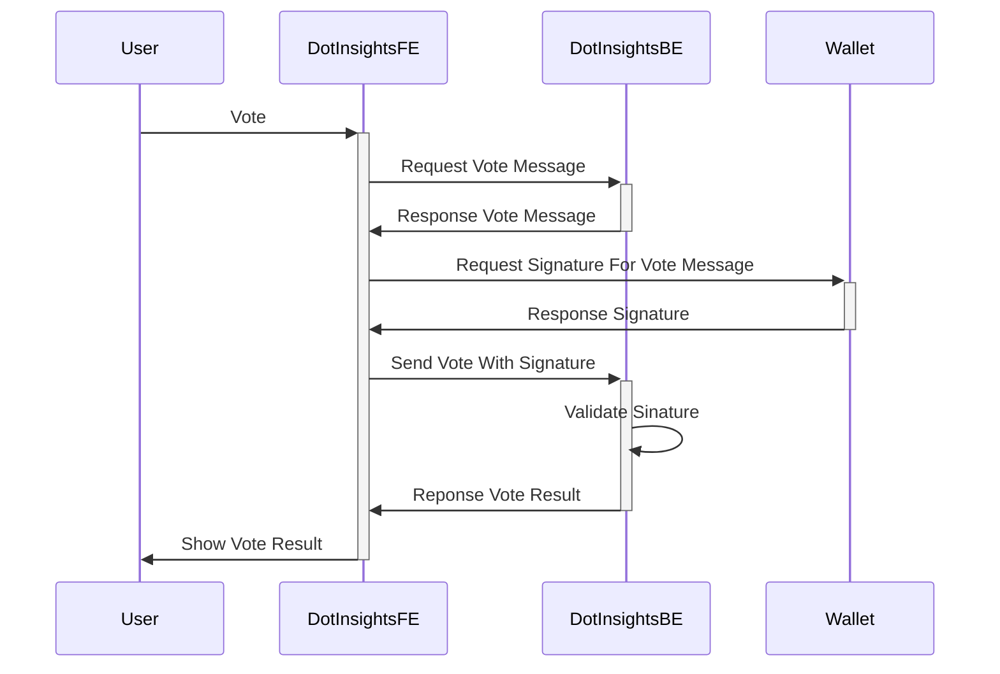

# DotInsights
## Voting Concept
Here is the main concept of voting for DotInsights.

```mermaid
sequenceDiagram
    User->>+DotInsightsFE: Vote
    DotInsightsFE->>+DotInsightsBE: Request Vote Message
    DotInsightsBE->>-DotInsightsFE: Response Vote Message
    DotInsightsFE->>+Wallet: Request Signature For Vote Message
    Wallet->>-DotInsightsFE: Response Signature
    DotInsightsFE->>+DotInsightsBE: Send Vote With Signature
    DotInsightsBE->>DotInsightsBE: Validate Sinature
    DotInsightsBE->>-DotInsightsFE: Reponse Vote Result
    DotInsightsFE->>-User: Show Vote Result
```
